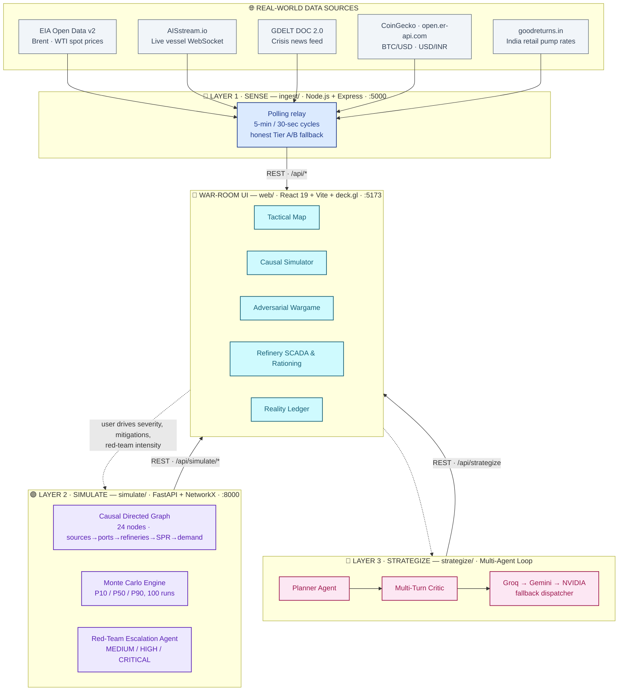
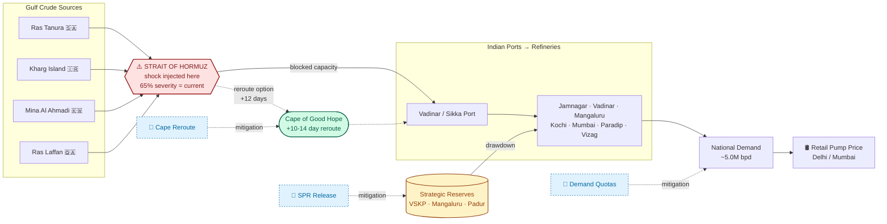
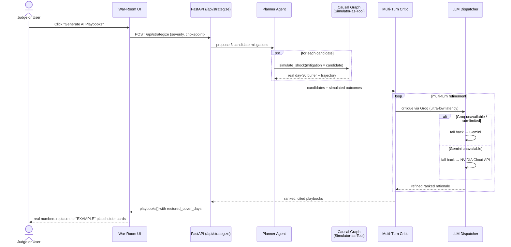
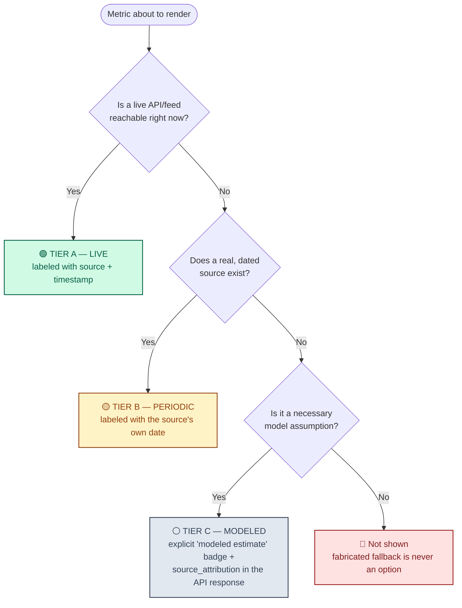
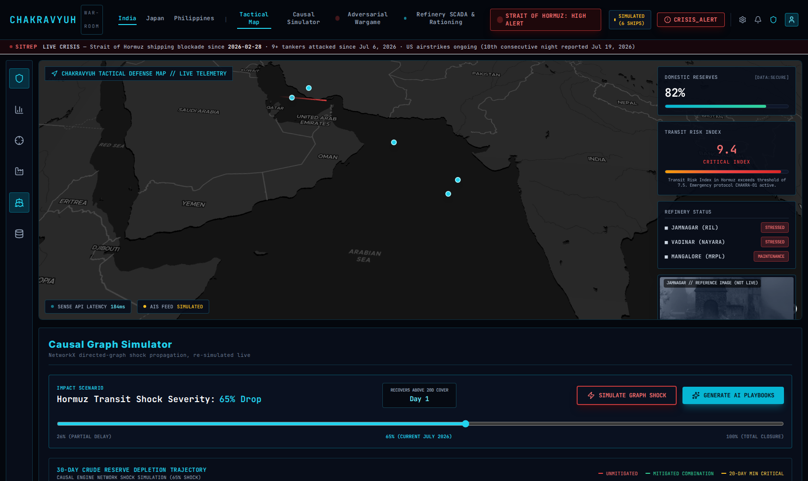
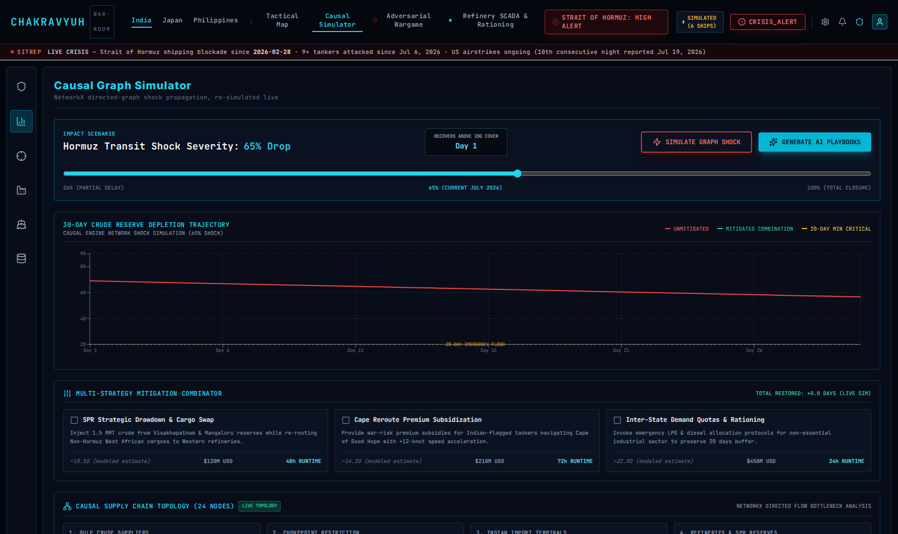

# 🛡️ Chakravyuh — AI War-Room for Energy Supply-Chain Resilience

**A causal simulation engine + multi-agent war-room for a crisis that is happening right now.**

<p>
  
  
  
</p>

<p>
  
  
  
  
  
</p>

---

## 🔥 This is not a hypothetical

Since **28 February 2026**, the US and Israel have been at war with Iran. The Strait of Hormuz — the channel **~20% of the world's crude oil** physically has to pass through — has been mined, boarded, and closed to commercial traffic by the IRGC. As of this week, at least **9 tankers have been attacked since July 6**, and US airstrikes on Iran are in their **10th consecutive night**.

Most "energy security" dashboards you'll see today are static risk monitors — a red/yellow/green light with no model behind it. **Chakravyuh asks a different question**: *if Hormuz transit drops another 20%, which refinery runs dry first, how many days of buffer does India actually have left, and what's the fastest real intervention to buy more time?* — then answers it with an actual directed-graph simulation, not a guess.

---

## 🧭 Table of Contents

- [Architecture](#-architecture)
- [How a shock actually propagates](#-how-a-shock-propagates-through-the-graph)
- [The multi-agent AI playbook loop](#-the-multi-agent-ai-playbook-loop)
- [The Reality Ledger — our answer to "is this data real?"](#-the-reality-ledger--our-answer-to-is-this-data-real)
- [See it running](#-see-it-running)
- [Tech stack](#-tech-stack)
- [Quick start](#-quick-start)
- [Project structure](#-project-structure)
- [Why this wins](#-why-this-wins)

---

## 🏗️ Architecture

Three independent services, each doing one job well, feeding a single war-room UI.



---

## ⚡ How a shock propagates through the graph

This is the actual topology `simulate/graph_engine.py` and `simulate/regional_graph.py` model — a real NetworkX `DiGraph`, not a static diagram. When you drag the severity slider, this is the path the shock physically walks, node by node, before it ever reaches a chart.



Every mitigation shown above is **wired to a real backend recomputation** (`POST /api/simulate` with `mitigation_applied`) — toggling one in the UI doesn't look up a canned number, it re-runs the graph.

---

## 🤖 The multi-agent AI playbook loop

Clicking **"Generate AI Playbooks"** doesn't call one model once — it runs a real Planner → Simulator-as-tool → Critic loop, with automatic multi-provider fallback so a single rate-limited key never kills the demo.



---

## 📋 The Reality Ledger — our answer to "is this data real?"

Every number on screen is put through the same honesty test before it's allowed to render. This is the single design principle the rest of the project is built around — a judge should never have to wonder whether a metric is live, dated, or invented.



| Metric | Source | Tier |
|---|---|---|
| Global crude spot (Brent / WTI) | EIA Open Data v2, polled every 5 min | 🟡 Tier B — daily benchmark series |
| India retail petrol/diesel (Delhi, Mumbai) | Live scrape, goodreturns.in, polled every 5 min | 🟢 Tier A when reachable → honestly falls back to a dated snapshot otherwise |
| BTC/USD, USD/INR | CoinGecko · open.er-api.com | 🟢 Tier A — 30-sec polling |
| Vessel positions | AISstream.io live WebSocket | 🟢 Tier A when the socket connects → clearly badged **SIMULATED** when it doesn't (never faked as live) |
| Crisis timeline (Hormuz events) | Wikipedia · CNBC · Washington Post · NPR, dated | 🟡 Tier B — sourced, dated, cited inline in the Reality Ledger modal |
| Causal-graph stress %, Monte Carlo bands, sectoral GDP-loss coefficients | This project's NetworkX/Monte Carlo model | ⚪ Tier C — every one carries a `source_attribution` field disclosing exactly what's modeled vs. measured |

---

## 🖥️ See it running

**Tactical Map** — live crisis SITREP, vessel corridor, refinery status, and the Tier A/B pump-price ticker, all in one view:



**Causal Simulator** — drag the severity slider, toggle real mitigations, watch the 30-day depletion trajectory recompute live:



---

## 🧰 Tech stack

| Layer | Stack |
|---|---|
| Frontend | React 19, Vite, TypeScript, Tailwind CSS v4, deck.gl (`TripsLayer`), MapLibre GL, Recharts, lucide-react |
| Sense (ingest) | Node.js, Express, native `ws` WebSocket client, Node core `https` |
| Simulate | Python, FastAPI, NetworkX (directed graph), NumPy (Monte Carlo), Pydantic |
| Strategize | Multi-agent Planner→Critic loop, `google-generativeai` + raw HTTP dispatch to Groq / NVIDIA Cloud API |
| Data | PPAC Ready Reckoner (real parsed PDF via `pdftotext`), verified SPR/refinery figures, dated crisis timeline |

---

## 🚀 Quick start

Full step-by-step setup (env files, exact commands, troubleshooting) lives in **[`DocumentForTeamate.md`](DocumentForTeamate.md)**. Short version:

```bash
git clone https://github.com/Anbu-00001/Chakravyuh.git
cd Chakravyuh
# place .env (root) and web/.env — see DocumentForTeamate.md

cd ingest && npm install && cd ..
cd web && npm install && cd ..
pip install -r simulate/requirements.txt && pip install google-generativeai

# 3 terminals, from repo root:
cd ingest && node index.js                                   # :5000
set -a; source .env; set +a; uvicorn simulate.main:app --port 8000 --reload   # :8000
cd web && npm run dev                                         # :5173
```

Open `http://localhost:5173`.

---

## 📁 Project structure

```
Chakravyuh/
├── ingest/          # Layer 1 · SENSE — Node/Express telemetry relay
├── simulate/         # Layer 2 · SIMULATE — FastAPI + NetworkX causal engine
├── strategize/        # Layer 3 · STRATEGIZE — multi-agent LLM playbook loop
├── web/            # War-Room UI — React 19 + Vite + deck.gl
├── data/           # seed.json (verified baselines) + real source PDFs
├── scripts/          # Data-provenance scripts (e.g. real PPAC PDF → seed.json)
└── DocumentForTeamate.md  # Full setup + demo walkthrough
```

---

## 🏆 Why this wins

- **It's not modeling a hypothetical.** The crisis is real, dated, sourced, and ongoing as of this week.
- **The simulation is a real graph, not a slider hooked to a formula.** 24-node NetworkX DAG, Monte Carlo P10/P50/P90, differentiated per-refinery stress based on each site's actual modeled Hormuz-dependency exposure.
- **Nothing on screen lies about what it is.** Every metric carries a tier — live, dated, or modeled — enforced by the Reality Ledger, down to individual coefficients in the simulation engines.
- **The AI layer is a real agent loop with real fallback**, not a single prompt-and-pray call to one API key.
